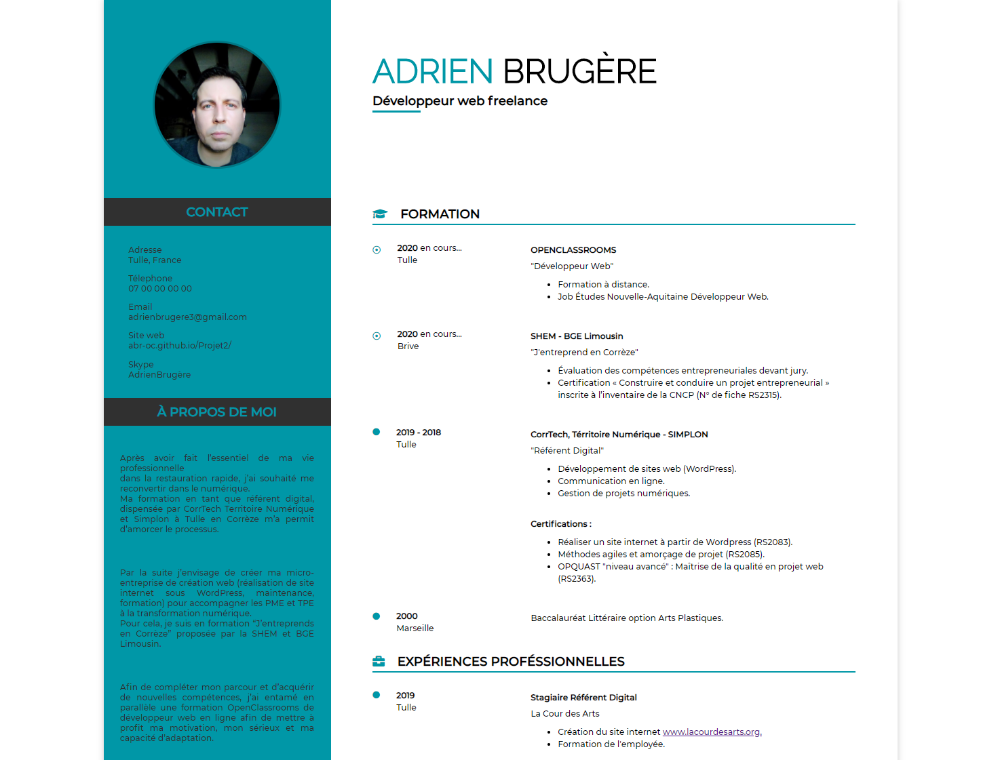

# Projet2 : OC-Projet 2 : Transformez votre CV en site Web

<h3>Objectif</h3>
● Créer son CV en ligne, en suivant un template fourni. 
● Et publier le résultat sur GitHub Pages.

<h3>Remarques sur l'évaluation</h3> 
<b>Compétences évaluées</b>  

1. Évaluation globale du travail réalisé par l’étudiant (en spécifiant les critères non-validés si le projet est à retravailler) :

Adrien a réalisé un bon projet qui répond correctement au cahier des charges. La présentation quant à elle est claire mais demanderait à être ré-adaptée pour un client. Cependant, pour une première soutenance, on considère que celle-ci convient. 

Les réponses aux questions sont plutôt bonnes.

2. Évaluation des livrables selon les critères du projet :

Tous les livrables demandés sont présents. Il y a aussi le diaporama présenté en soutenance.

3. Évaluation de la présentation orale et sa conformité aux attentes :

🎯 Définir la structure d'une page web à partir d'une maquette

La compétence est validée

🎯 Préparer des éléments graphiques et textuels à intégrer à une page web

La compétence est validée

🎯 Intégrer du contenu conformément à une maquette

Le contenu de la page web est complet

Le contenu de la page est pertinent

Le contenu de la page web est présentable

🎯 Assurer la conformité d'une page web aux standards HTML et CSS

La structure de la page web est complète

La structure de la page web est pertinente

La structure du site web est présentable

🎯 Adapter l'affichage d'un site web à des écrans de petite taille.

La responsivité du site est complète

La responsivité du site web est pertinente

La responsivité du site est présentable

🎯 Utiliser un système de gestion de versions pour le suivi du projet et son hébergement.

La compétence est validée

4. Évaluation des nouvelles compétences acquises par l'étudiant :

 

Préparer des éléments graphiques et textuels à intégrer à une page web
Intégrer du contenu conformément à une maquette
Définir la structure d'une page web à partir d'une maquette
Utiliser un système de gestion de versions pour le suivi du projet et son hébergement
Adapter l'affichage d'un site web à des écrans de petite taille
Assurer la conformité d'une page web aux standards HTML et CSS
 

 

5. Points positifs (au moins 1) :

- Le site est bien responsive

- Les slides sur git ne sont pas une mauvaise idée

- Le code est valide aux normes W3C

- Un powerpoint de présentation a été fait

- L'étudiant a bien revu après soutenance le but du meta charset

 

6. Axes d'amélioration (au moins 1) :

- Adapter davantage la présentation pour un client néophyte en programmation web

- Corriger les 2 warnings soulevés par le validateur W3C HTML (en réorganisant pourquoi pas la structure HTML de manière à utiliser davantage de balises sémantiques)

Bonne continuation
